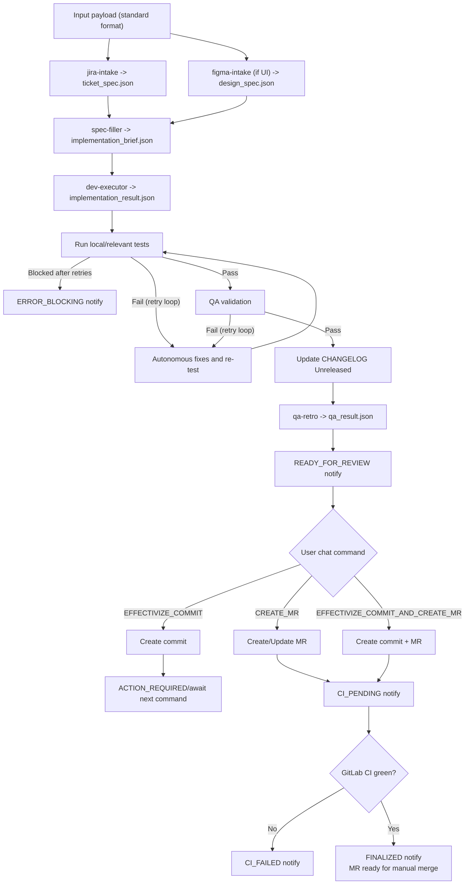

# Pipeline Workflow (Canonical)

## 1) Standard input (always use this)
Use this exact payload format when starting a run:

```md
JIRA_KEY: <ISSUE-ID>
JIRA_URL: https://your-domain.atlassian.net/browse/<ISSUE-ID>
FIGMA_URL: https://www.figma.com/design/<fileKey>/<name>?node-id=<id>
FIGMA_NODE_IDS: 12:34,56:78
REPO_PATH: /absolute/path/to/repo
TARGET_BASE_BRANCH: dev|develop|development
NOTIFY_GOOGLE_CHAT: true
```

Notes:
- `JIRA_KEY` is mandatory.
- `FIGMA_URL` and `FIGMA_NODE_IDS` are mandatory only for UI work.
- `REPO_PATH` is mandatory for implementation runs.

## 2) Execution sequence
1. `jira-intake` -> `ticket_spec.json`
2. `figma-intake` (if UI task) -> `design_spec.json`
3. `spec-filler` -> `implementation_brief.json`
4. `dev-executor` -> code changes + `implementation_result.json`
5. Run local/relevant tests
6. QA validation
7. Update `CHANGELOG.md` under `Unreleased` from real code diff
8. `qa-retro` -> `qa_result.json` (`merge_gates` + `mergeable`)
9. Send `READY_FOR_REVIEW` notification
10. Wait for user command in this same chat:
- `EFFECTIVIZE_COMMIT`
- `CREATE_MR`
- `EFFECTIVIZE_COMMIT_AND_CREATE_MR`
11. If command includes MR creation, open/update MR in GitLab
12. CI runs in GitLab MR (external gate)
13. If CI green + QA approved + changelog updated -> `FINALIZED` notification

## 3) CI clarification
- CI tests are not executed in this local pipeline step.
- CI is executed by GitLab when MR is created/updated.
- Until CI finishes green, merge decision must be considered pending.

## 4) Notification policy (Google Chat)
Send notification on every event below:

1. `ACTION_REQUIRED`
    - user action needed (missing data, QA execution, explicit commit/MR command)

2. `READY_FOR_REVIEW`
    - local/QA/changelog gates passed, waiting your explicit chat command

3. `CI_PENDING`
    - MR created/updated, waiting GitLab CI

4. `CI_FAILED`
    - GitLab CI failed

5. `ERROR_BLOCKING`
    - only when the agent cannot solve the issue after autonomous retries/iterations

6. `FINALIZED`
    - process completed (ready to merge or merged manually)

## 5) Error handling policy
- On failure, the agent must attempt autonomous diagnosis and correction before escalating.
- `ERROR_BLOCKING` is emitted only after retries are exhausted or a hard external blocker remains.

## 6) Mermaid diagram

