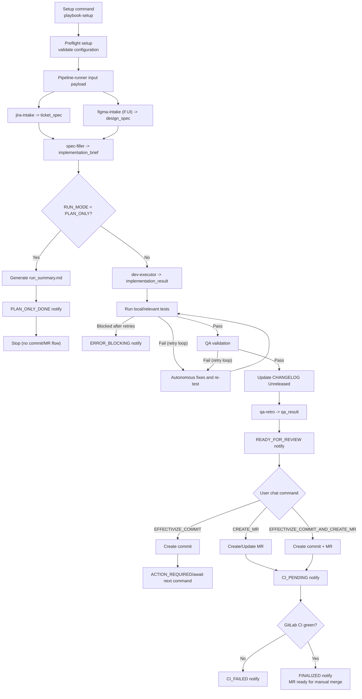

# Pipeline Workflow (Canonical)

## 1) Setup command (one-time per project)
Use this to initialize per-project defaults and context:

```md
Use playbook-setup with this payload:
SETUP_MODE: INIT|UPDATE
REPO_PATH: /absolute/path/to/repo
PROJECT_NAME: <name>
JIRA_PROJECT_KEY: <e.g. LSF>
JIRA_BASE_URL: https://your-domain.atlassian.net
FIGMA_BASE_URL: https://www.figma.com/design/<fileKey>/<name>
ARCHITECTURE_OVERRIDE: <optional, e.g. Clean + Coordinator>
TARGET_BASE_BRANCH: <dev|develop|development>
NOTIFY_GOOGLE_CHAT: true
AUTO_DETECT_CONTEXT: true
TECH_CONTEXT: |
  Architecture notes, module boundaries, backend constraints.
PROJECT_CONTEXT_PATHS: docs/architecture.md,README.md,Sources/App/CompositionRoot.swift
WRITE_ARTIFACTS: false
# only when WRITE_ARTIFACTS=true
ARTIFACTS_PATH: <REPO_PATH>/.codex/pipeline-runner
```

Notes:
- This setup is executed from chat through `playbook-setup`.
- `SETUP_MODE=INIT` bootstraps config + autodetected context.
- `SETUP_MODE=UPDATE` updates existing global setup values without rebootstrap.
- In `SETUP_MODE=UPDATE`, `REPO_PATH` is optional: it uses `repo_path` saved by `INIT` in `.codex/playbook.config.yml`.
- If `ARCHITECTURE_OVERRIDE` is provided, that value is used as architecture source of truth and autodetection becomes fallback.
- No user terminal command is required.
- The skill auto-generates `.codex/project_context.auto.md` and `.codex/project_context_paths.auto.txt`.
- `playbook-setup` must run preflight in `setup` mode right after writing config.

## 2) Preflight setup (required)
1. Run preflight validator before any implementation step:
   - `<PLAYBOOK_ROOT>/scripts/preflight_pipeline_runner.sh`
   - Optional structured output: `--output-format json`
2. Resolve canonical playbook path and contracts before executing any step.
3. Resolve effective configuration with this precedence:
   - explicit payload fields
   - values from auto-loaded `<REPO_ROOT>/.codex/playbook.config.yml`
   - runner defaults
4. If setup config defines `project.jira_project_key`, validate ticket prefix (`<KEY>-<number>`).
5. Load project context from:
   - setup config `PROJECT_CONTEXT_PATHS`, then
   - `<REPO_ROOT>/.codex/project_context_paths.auto.txt` when present.
6. Load technical context from:
   - runtime payload `TECH_CONTEXT` (task-specific), then
   - `<REPO_ROOT>/.codex/project_context.auto.md` when present.
   - if `AUTO_DETECT_CONTEXT=false`, skip auto context files and rely on provided context only.
7. If `RUN_MODE=REAL_RUN`, enforce branch setup before editing:
   - checkout `TARGET_BASE_BRANCH`
   - run `git pull -r`
   - create/switch to a working branch (`<ISSUE-ID>-<kind>-<desc>`)
8. Never implement directly on base branch (`dev`/`develop`/`development`).

Preflight failure policy:
- `ERROR_BLOCKING` for all failed checks, except base branch local-missing/remote-existing.
- Base branch handling:
  - local missing + remote existing: continue and let runner fetch/track.
  - local missing + remote missing: block.
- Missing/invalid `JIRA_BASE_URL`: block.
- Missing/invalid `FIGMA_BASE_URL` when `FIGMA_NODE_IDS` is provided: block.

Preflight output modes:
- `text` (default): human-readable.
- `json`: structured diagnostics (`status`, `code`, `field`, `message`, `warnings`).

## 3) Standard input (always use this)
Use this exact payload format when starting a run:

```md
Use pipeline-runner with this payload:
JIRA_KEY: <ISSUE-ID>
FIGMA_NODE_IDS: 12:34,56:78
RUN_MODE: REAL_RUN|DRY_RUN|PLAN_ONLY

# optional, task-specific technical context
TECH_CONTEXT: |
  Task-level technical notes, constraints, backend contracts.
```

Notes:
- `JIRA_KEY` is mandatory.
- `FIGMA_NODE_IDS` is mandatory only for UI work.
- `JIRA_URL` and `FIGMA_URL` are derived from `playbook-setup` config.
- Runner auto-loads `<REPO_ROOT>/.codex/playbook.config.yml`; if missing, it must fail and request running `playbook-setup`.
- `RUN_MODE` defaults to `REAL_RUN` if omitted.
- `TECH_CONTEXT` here is task-specific (not project-wide setup).
- `AUTO_DETECT_CONTEXT`, `PROJECT_CONTEXT_PATHS`, `WRITE_ARTIFACTS` and `ARTIFACTS_PATH` are managed by `playbook-setup` in project config.
- Run-mode behavior:
  - `PLAN_ONLY`: run intake/spec/planning only; do not edit code, do not update changelog, do not execute commit/MR actions.
  - `DRY_RUN`: simulation mode, no repository mutation.
  - `REAL_RUN`: full execution mode.

## 4) Execution sequence
1. `jira-intake` -> `ticket_spec` (in-memory or artifact file based on `WRITE_ARTIFACTS`)
2. `figma-intake` (if UI task) -> `design_spec`
3. `spec-filler` -> `implementation_brief`
4. `dev-executor` -> code changes + `implementation_result` (skip when `PLAN_ONLY`)
5. Run local/relevant tests
6. QA validation
7. Update `CHANGELOG.md` under `Unreleased` from real code diff
8. `qa-retro` -> `qa_result` (`merge_gates` + `mergeable`)
9. If `RUN_MODE=PLAN_ONLY`, generate `run_summary.md`, send `PLAN_ONLY_DONE` notification, and stop.
10. Send `READY_FOR_REVIEW` notification (non-PLAN_ONLY only)
11. Wait for user command in this same chat (non-PLAN_ONLY only):
- `EFFECTIVIZE_COMMIT`
- `CREATE_MR`
- `EFFECTIVIZE_COMMIT_AND_CREATE_MR`
12. If command includes MR creation, open/update MR in GitLab
13. CI runs in GitLab MR (external gate)
14. For non-`PLAN_ONLY` runs, generate `run_summary.md` at pipeline close (default: `<REPO_ROOT>/.codex/pipeline-runner/<JIRA_KEY>/run_summary.md`).
15. If CI green + QA approved + changelog updated -> `FINALIZED` notification
16. `run_summary.md` is mode-aware:
   - `PLAN_ONLY`: plan, forecast files, risks/unknowns, next action.
   - `REAL_RUN/DRY_RUN`: scope, changed files, validation, blockers, next action.

## 5) CI clarification
- CI tests are not executed in this local pipeline step.
- CI is executed by GitLab when MR is created/updated.
- Until CI finishes green, merge decision must be considered pending.

## 6) Notification policy (Google Chat)
Send notification on every event below:

1. `ACTION_REQUIRED`
- user action needed (missing data, QA execution, explicit commit/MR command)

2. `PLAN_ONLY_DONE`
- plan generated, no code changes, no commit/MR actions expected

3. `READY_FOR_REVIEW`
- local/QA/changelog gates passed, waiting your explicit chat command

4. `CI_PENDING`
- MR created/updated, waiting GitLab CI

5. `CI_FAILED`
- GitLab CI failed

6. `ERROR_BLOCKING`
- only when the agent cannot solve the issue after autonomous retries/iterations

7. `FINALIZED`
- process completed (ready to merge or merged manually)

## 7) Error handling policy
- On failure, the agent must attempt autonomous diagnosis and correction before escalating.
- `ERROR_BLOCKING` is emitted only after retries are exhausted or a hard external blocker remains.

## 8) Artifact policy
- Default: do not write pipeline artifacts into the target project repository.
- If `WRITE_ARTIFACTS=true`, write artifacts to `ARTIFACTS_PATH` (recommended: `<REPO_ROOT>/.codex/pipeline-runner`).
- Artifact files:
  - `ticket_spec.json`
  - `design_spec.json`
  - `implementation_brief.json`
  - `implementation_result.json`
  - `qa_result.json`

## 9) Mermaid diagram

